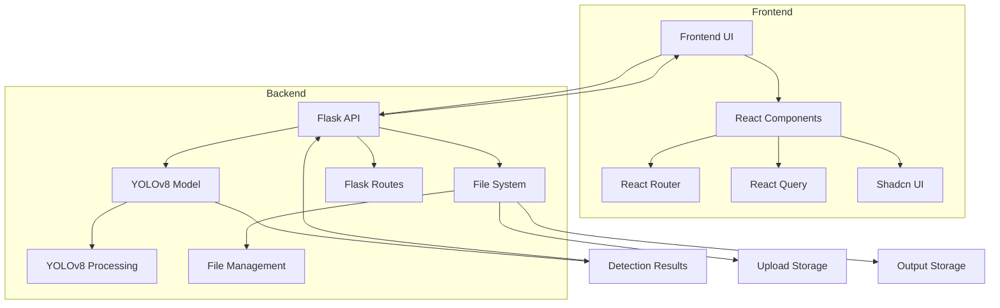

# System Patterns

## Architecture Overview


## Core Components

### 1. Frontend Layer (React)
- **Framework**: React 18 with TypeScript
- **Build Tool**: Vite
- **Key Features**:
  - React Router for navigation
  - React Query for data fetching
  - Shadcn UI components
  - Tailwind CSS styling
- **Directory Structure**:
  - components/: Reusable UI components
  - hooks/: Custom React hooks
  - lib/: Utility functions
  - pages/: Route components
  - App.tsx: Main application component

### 2. API Layer (Flask)
- **Port Configuration**: Using port 5001 to avoid AirPlay conflicts
- **Endpoints**:
  - GET /health - System health check
  - POST /detect - Image processing and detection
- **Error Handling**: Basic implementation with proper HTTP status codes
- **Response Format**: JSON with structured detection data

### 3. Detection System (YOLOv8)
- **Model Integration**: Direct integration with Flask
- **Configuration**:
  - Detection threshold: 0.3
  - Model path: ./yolov8_model/runs/detect/Normal_Compressed/weights/best.pt
- **Processing Flow**:
  1. Image upload
  2. Model inference
  3. Result processing
  4. Image annotation
  5. Result storage
- **Output Classes**:
  - guns
  - knife

### 4. File Management
- **Upload System**:
  - Directory: ./uploads/
  - Unique filename generation
  - File type validation
- **Output System**:
  - Directory: ./yolov8_model/imgs/Test/
  - Annotated image storage
  - Consistent naming convention

### 5. Configuration Management
- **Environment Variables**:
  - Flask configuration
  - Model paths
  - Detection settings
  - File paths
- **Centralized Configuration**: Using .env file

## Design Patterns

### 1. Frontend Patterns
```typescript
// Component Pattern
const Component: React.FC<Props> = ({ prop1, prop2 }) => {
  const { data, isLoading } = useQuery(['key'], fetchData);
  
  return (
    <div className="container">
      {isLoading ? <LoadingSpinner /> : <DataDisplay data={data} />}
    </div>
  );
};

// API Integration Pattern
const useDetection = () => {
  return useMutation({
    mutationFn: (image: File) => {
      const formData = new FormData();
      formData.append('image', image);
      return fetch('/detect', {
        method: 'POST',
        body: formData,
      }).then(res => res.json());
    },
  });
};
```

### 2. Backend Request-Response Pattern
```python
@app.route('/detect', methods=['POST'])
def detect():
    try:
        # Process request
        # Perform detection
        # Format response
        return jsonify({
            "message": "Detection completed successfully",
            "original_image": filepath,
            "annotated_image": result_path,
            "detections": [
                {
                    "class": "guns",
                    "confidence": 0.40,
                    "bbox": {
                        "xmin": 752,
                        "ymin": 940,
                        "xmax": 836,
                        "ymax": 1046
                    }
                }
            ],
            "image_info": {
                "shape": [1600, 1001, 3],
                "original_path": filepath
            },
            "model_info": {
                "path": model_path,
                "classes": {"0": "guns", "1": "knife"}
            }
        })
    except Exception as e:
        return handle_error(e)
```

### 3. Error Handling Pattern
```python
# Consistent error response format
{
    "error": "Error message",
    "status": "error"
}
```

### 4. File Processing Pattern
```python
# Standard file handling flow
1. Validate file
2. Generate unique filename
3. Save to uploads
4. Process with model
5. Save results
6. Return paths and detection data
```

## Integration Patterns

### 1. Frontend-Backend Integration
- RESTful API communication
- FormData for file uploads
- React Query for data fetching
- Error handling and loading states
- Type-safe API responses

### 2. Model Integration
- Direct model loading in Flask
- Synchronous processing
- Result caching (if implemented)
- Structured detection data output

### 3. File System Integration
- Local file storage
- Path management
- Cleanup procedures (to be implemented)

## Security Patterns
- Basic file validation
- Error message sanitization
- Path traversal prevention
- CORS configuration
- Input sanitization

## Performance Considerations
- Image size handling
- Memory management
- Processing time optimization
- Detection data structure optimization
- Frontend bundle optimization
- Code splitting
- Lazy loading

## Monitoring Patterns
- Health check endpoint
- Basic error logging
- Performance monitoring (to be implemented)
- Detection statistics tracking
- Frontend error tracking
- User analytics (to be implemented) 