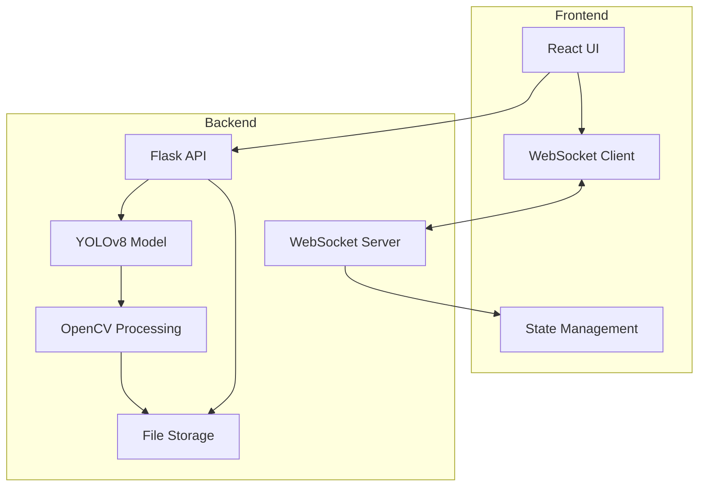
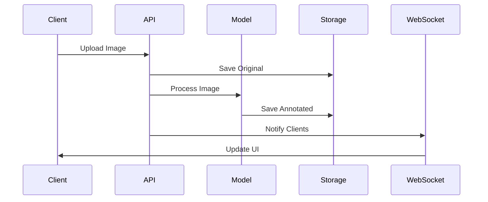

# System Patterns

## Architecture Overview



## Design Patterns

### Backend Patterns

1. **Observer Pattern**
   - WebSocket server notifies all connected clients of new detections
   - Clients receive real-time updates without polling

2. **Factory Pattern**
   - Detection processing pipeline
   - Image annotation generation
   - Response formatting

3. **Singleton Pattern**
   - YOLOv8 model instance
   - WebSocket server
   - File storage management

4. **Strategy Pattern**
   - Detection threshold configuration
   - Image processing options
   - Alert severity classification

### Frontend Patterns

1. **Component Pattern**
   - Reusable UI components
   - Camera feed display
   - Alert notifications

2. **Observer Pattern**
   - WebSocket client for real-time updates
   - State updates based on backend events

3. **Container/Presenter Pattern**
   - Separation of data management and presentation
   - Camera feed container and presenter components

## Data Flow



## File Structure

```
backend/
├── static/
│   └── images/
│       ├── uploads/     # Original images
│       └── annotated/   # Processed images
├── app.py              # Main application
└── requirements.txt    # Dependencies

frontend/
├── src/
│   ├── components/     # Reusable components
│   ├── hooks/         # Custom hooks
│   ├── lib/           # Utilities
│   └── styles/        # CSS/Tailwind
└── package.json
```

## Communication Patterns

1. **REST API**
   - Image upload
   - Detection requests
   - Health checks

2. **WebSocket**
   - Real-time detection notifications
   - Connection management
   - Client tracking

3. **Static File Serving**
   - Original images
   - Annotated images
   - Asset delivery

## Error Handling

1. **Backend**
   - Input validation
   - File processing errors
   - Model errors
   - Storage errors

2. **Frontend**
   - Network errors
   - WebSocket disconnections
   - Image loading errors
   - UI state errors

## Security Patterns

1. **Input Validation**
   - File type checking
   - Size limits
   - Content validation

2. **Output Sanitization**
   - File path sanitization
   - Response data cleaning
   - Error message sanitization

3. **Resource Protection**
   - Rate limiting
   - File size limits
   - Connection limits

## Optimization Patterns

1. **Image Processing**
   - Efficient annotation
   - Memory management
   - Batch processing

2. **WebSocket**
   - Connection pooling
   - Message batching
   - Reconnection handling

3. **Frontend**
   - Image caching
   - State management
   - UI updates

## Core Components

### 1. Frontend Layer (React)
- **Framework**: React 18 with TypeScript
- **Build Tool**: Vite
- **Key Features**:
  - React Router for navigation
  - React Query for data fetching
  - Shadcn UI components
  - Tailwind CSS styling
- **Directory Structure**:
  - components/: Reusable UI components
  - hooks/: Custom React hooks
  - lib/: Utility functions
  - pages/: Route components
  - App.tsx: Main application component

### 2. API Layer (Flask)
- **Port Configuration**: Using port 5001 to avoid AirPlay conflicts
- **Endpoints**:
  - GET /health - System health check
  - POST /detect - Image processing and detection
- **Error Handling**: Basic implementation with proper HTTP status codes
- **Response Format**: JSON with structured detection data

### 3. Detection System (YOLOv8)
- **Model Integration**: Direct integration with Flask
- **Configuration**:
  - Detection threshold: 0.3
  - Model path: ./yolov8_model/runs/detect/Normal_Compressed/weights/best.pt
- **Processing Flow**:
  1. Image upload
  2. Model inference
  3. Result processing
  4. Image annotation
  5. Result storage
- **Output Classes**:
  - guns
  - knife

### 4. File Management
- **Upload System**:
  - Directory: ./uploads/
  - Unique filename generation
  - File type validation
- **Output System**:
  - Directory: ./yolov8_model/imgs/Test/
  - Annotated image storage
  - Consistent naming convention

### 5. Configuration Management
- **Environment Variables**:
  - Flask configuration
  - Model paths
  - Detection settings
  - File paths
- **Centralized Configuration**: Using .env file

## Integration Patterns

### 1. Frontend-Backend Integration
- RESTful API communication
- FormData for file uploads
- React Query for data fetching
- Error handling and loading states
- Type-safe API responses

### 2. Model Integration
- Direct model loading in Flask
- Synchronous processing
- Result caching (if implemented)
- Structured detection data output

### 3. File System Integration
- Local file storage
- Path management
- Cleanup procedures (to be implemented)

## Performance Considerations
- Image size handling
- Memory management
- Processing time optimization
- Detection data structure optimization
- Frontend bundle optimization
- Code splitting
- Lazy loading

## Monitoring Patterns
- Health check endpoint
- Basic error logging
- Performance monitoring (to be implemented)
- Detection statistics tracking
- Frontend error tracking
- User analytics (to be implemented) 