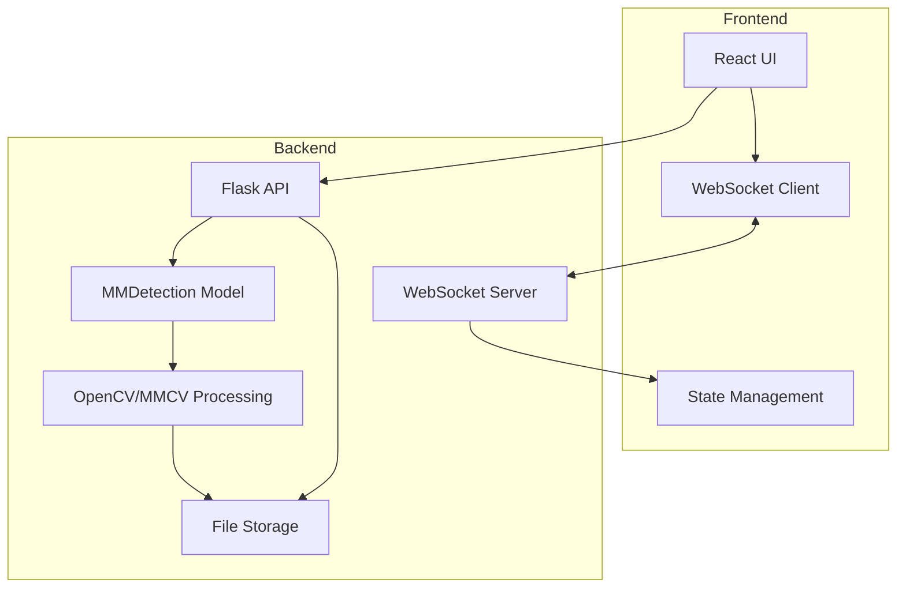
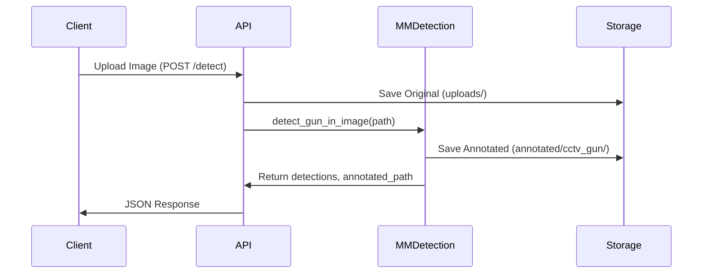
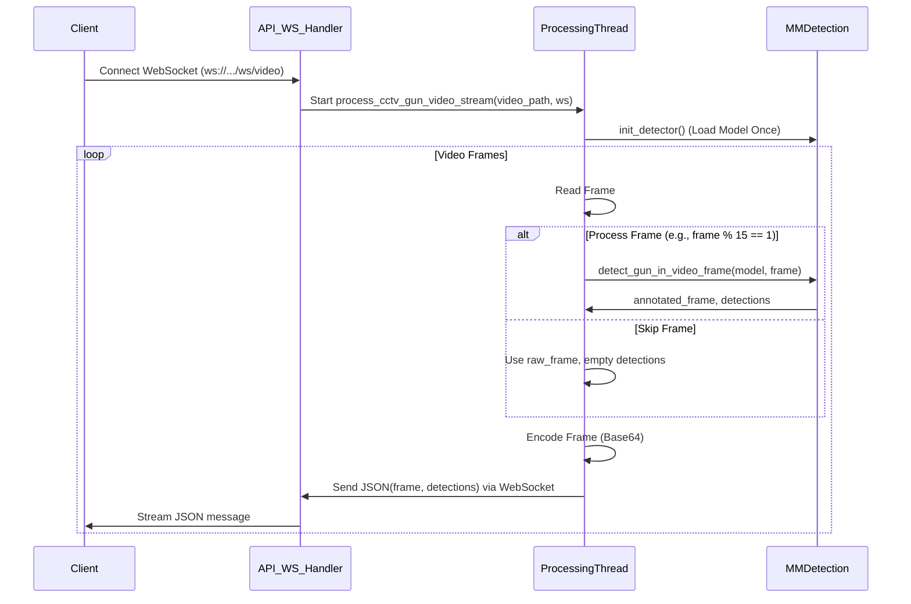

# System Patterns

## Architecture Overview



## Design Patterns

### Backend Patterns

1. **Observer Pattern**
   - WebSocket server streams processed video frames and detection results.
   - Clients receive real-time updates without polling.

2. **Factory Pattern**
   - Not explicitly used, but `init_detector` acts like a factory for the model.

3. **Singleton Pattern (Implicit)**
   - The MMDetection model is loaded once per video stream thread.
   - Flask app instance.

4. **Strategy Pattern**
   - Configurable inference device (`cpu`/`cuda:0`).
   - Detection threshold configuration.
   - Frame skipping interval.

### Frontend Patterns

1. **Component Pattern**
   - Reusable UI components
   - Camera feed display
   - Alert notifications

2. **Observer Pattern**
   - WebSocket client for real-time updates
   - State updates based on backend events

3. **Container/Presenter Pattern**
   - Separation of data management and presentation
   - Camera feed container and presenter components

## Data Flow





## File Structure

```
backend/
├── CCTV_GUN/           # MMDetection Model and Logic
│   ├── detecting_images.py # Image and Video detection functions
│   ├── requirements.txt    # Model-specific Python dependencies
│   ├── configs/          # MMDetection configuration files
│   ├── work_dirs/        # Checkpoints, logs from training
│   └── requirements/     # Original conda env file (env.yml)
│   └── ... (mmdet library code, tools, etc.)
├── static/
│   └── images/
│       ├── uploads/        # Original uploaded images
│       └── annotated/      # Annotated images
│           └── cctv_gun/   # Annotated images from MMDetection
├── yolov8_model/       # Old model (To be removed?)
│   └── ...
├── app.py              # Main Flask application
└── requirements.txt    # Server-level Python dependencies

frontend/
├── src/
│   ├── components/     # Reusable components
│   ├── hooks/         # Custom hooks
│   ├── lib/           # Utilities
│   └── styles/        # CSS/Tailwind
└── package.json
```

## Communication Patterns

1. **REST API**
   - Image upload
   - Detection requests
   - Health checks

2. **WebSocket**
   - Real-time detection notifications
   - Connection management
   - Client tracking

3. **Static File Serving**
   - Original images
   - Annotated images
   - Asset delivery

## Error Handling

1. **Backend**
   - Input validation
   - File processing errors
   - Model errors
   - Storage errors

2. **Frontend**
   - Network errors
   - WebSocket disconnections
   - Image loading errors
   - UI state errors

## Security Patterns

1. **Input Validation**
   - File type checking
   - Size limits
   - Content validation

2. **Output Sanitization**
   - File path sanitization
   - Response data cleaning
   - Error message sanitization

3. **Resource Protection**
   - Rate limiting
   - File size limits
   - Connection limits

## Optimization Patterns

1. **Frame Skipping:** Video detection runs only on Nth frame.
2. **Model Loaded Once:** For video streams, the detection model is loaded once per connection.
3. **GPU Acceleration (Planned):** Offload inference to GPU.

## Core Components

### 1. Frontend Layer (React)
- **Framework**: React 18 with TypeScript
- **Build Tool**: Vite
- **Key Features**:
  - React Router for navigation
  - React Query for data fetching
  - Shadcn UI components
  - Tailwind CSS styling
- **Directory Structure**:
  - components/: Reusable UI components
  - hooks/: Custom React hooks
  - lib/: Utility functions
  - pages/: Route components
  - App.tsx: Main application component

### 2. API Layer (Flask)
- **Port Configuration**: 5001
- **Endpoints**:
  - GET /health - System health check
  - POST /detect - Image processing (MMDetection)
  - GET /static/images/<path> - Serve static images
  - WebSocket /ws/video - Video stream processing (MMDetection)
- **Error Handling**: Basic implementation
- **Response Format**: JSON

### 3. Detection System (MMDetection)
- **Source:** `backend/CCTV_GUN/`
- **Model Integration**: Functions called from Flask handlers.
- **Configuration**:
  - Config: `backend/CCTV_GUN/configs/gun_detection/convnext.py`
  - Checkpoint: `backend/CCTV_GUN/work_dirs/convnext/epoch_3.pth`
  - Detection threshold: 0.3
  - Device: Currently `cpu`, plan `cuda:0`
- **Processing Flow**:
  - Image: `detect_gun_in_image` (Load model per call currently - potential optimization)
  - Video: `process_cctv_gun_video_stream` calls `detect_gun_in_video_frame` (Loads model once)
- **Output Classes**: `gun`

### 4. File Management
- **Upload System**:
  - Directory: `backend/static/images/uploads/`
  - Werkzeug `secure_filename`
- **Output System**:
  - Directory: `backend/static/images/annotated/cctv_gun/`
  - Naming: `annotated_cctv_gun_<original_filename>`

### 5. Configuration Management
- **Environment Variables**:
  - Flask configuration
  - Model paths
  - Detection settings
  - File paths
- **Centralized Configuration**: Using .env file

## Integration Patterns

### 1. Frontend-Backend Integration
- RESTful API communication
- FormData for file uploads
- React Query for data fetching
- Error handling and loading states
- Type-safe API responses

### 2. Model Integration
- Direct model loading in Flask
- Synchronous processing
- Result caching (if implemented)
- Structured detection data output

### 3. File System Integration
- Local file storage
- Path management
- Cleanup procedures (to be implemented)

## Performance Considerations
- Image size handling
- Memory management
- Processing time optimization
- Detection data structure optimization
- Frontend bundle optimization
- Code splitting
- Lazy loading

## Monitoring Patterns
- Health check endpoint
- Basic error logging
- Performance monitoring (to be implemented)
- Detection statistics tracking
- Frontend error tracking
- User analytics (to be implemented) 